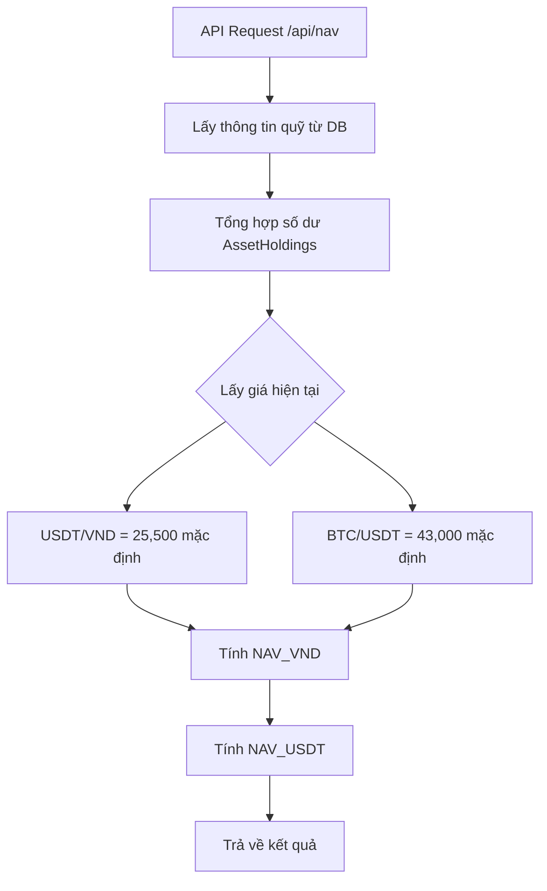
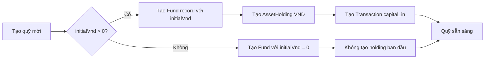
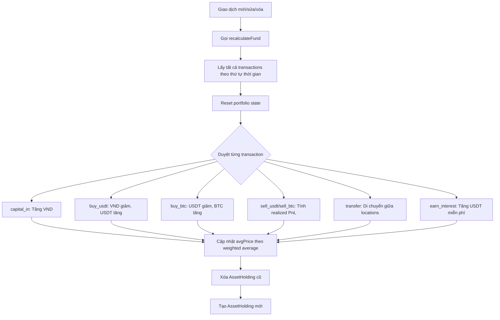

# Tài Liệu Kỹ Thuật - Hệ Thống Quản Lý Quỹ Đầu Tư Cá Nhân

> Tài liệu này mô tả chi tiết cách tính NAV, uPNL, thuật toán lấy giá P2P, và cách tính vốn ban đầu của ứng dụng.

---

## 📌 Tổng Quan Kiến Trúc

### Công Nghệ Sử Dụng
- **Frontend**: Next.js 15 (App Router) + TypeScript
- **Database**: SQLite với Prisma ORM
- **API Routes**: Next.js API Routes
- **Styling**: Tailwind CSS

### Các File Quan Trọng
- [src/app/api/nav/route.ts](file:///Users/sotacom/Downloads/workspace-6d2fcc32-1433-4b63-9a99-77c481efc748%20(1)/src/app/api/nav/route.ts) - API tính NAV và uPNL
- [src/lib/fund-calculator.ts](file:///Users/sotacom/Downloads/workspace-6d2fcc32-1433-4b63-9a99-77c481efc748%20(1)/src/lib/fund-calculator.ts) - Logic tính toán quỹ
- [src/app/api/funds/route.ts](file:///Users/sotacom/Downloads/workspace-6d2fcc32-1433-4b63-9a99-77c481efc748%20(1)/src/app/api/funds/route.ts) - API quản lý quỹ
- [prisma/schema.prisma](file:///Users/sotacom/Downloads/workspace-6d2fcc32-1433-4b63-9a99-77c481efc748%20(1)/prisma/schema.prisma) - Database schema

---

## 💰 1. Cách Tính NAV (Net Asset Value)

### 1.1. Định Nghĩa
NAV là tổng giá trị tài sản ròng của quỹ, bao gồm tất cả các tài sản (VND, USDT, BTC) được quy đổi về một đơn vị tiền tệ.

### 1.2. Công Thức Tính

#### NAV theo VND
```typescript
NAV_VND = VND_cash + (USDT_balance × USDT_VND_Price) + (BTC_balance × BTC_USDT_Price × USDT_VND_Price)
```

**Vị trí code**: [src/app/api/nav/route.ts#L48](file:///Users/sotacom/Downloads/workspace-6d2fcc32-1433-4b63-9a99-77c481efc748%20(1)/src/app/api/nav/route.ts#L48)

```typescript
const navVnd = vndCash + (usdtBalance * usdtVndPrice) + (btcBalance * btcUsdtPrice * usdtVndPrice)
```

#### NAV theo USDT
```typescript
NAV_USDT = (VND_cash / USDT_VND_Price) + USDT_balance + (BTC_balance × BTC_USDT_Price)
```

**Vị trí code**: [src/app/api/nav/route.ts#L51](file:///Users/sotacom/Downloads/workspace-6d2fcc32-1433-4b63-9a99-77c481efc748%20(1)/src/app/api/nav/route.ts#L51)

```typescript
const navUsdt = (vndCash / usdtVndPrice) + usdtBalance + (btcBalance * btcUsdtPrice)
```

### 1.3. Luồng Tính Toán



### 1.4. Cách Lấy Số Dư Hiện Tại

**Vị trí code**: [src/app/api/nav/route.ts#L33-L41](file:///Users/sotacom/Downloads/workspace-6d2fcc32-1433-4b63-9a99-77c481efc748%20(1)/src/app/api/nav/route.ts#L33-L41)

```typescript
// Lấy số dư hiện tại của từng tài sản
const holdings = fund.assetHoldings.reduce((acc, holding) => {
  acc[holding.asset] = (acc[holding.asset] || 0) + holding.amount
  return acc
}, {} as Record<string, number>)

const vndCash = holdings['VND'] || 0
const usdtBalance = holdings['USDT'] || 0
const btcBalance = holdings['BTC'] || 0
```

> [!NOTE]
> Hệ thống tổng hợp tất cả `AssetHolding` records với cùng 1 loại tài sản để tính tổng số dư.

---

## 📊 2. Cách Tính uPNL (Unrealized Profit & Loss)

### 2.1. Định Nghĩa
uPNL là lãi/lỗ chưa hiện thực - chênh lệch giữa giá trị NAV hiện tại và vốn ban đầu.

### 2.2. Công Thức Tính

```typescript
uPNL_VND = NAV_VND - initialVnd
uPNL_Percentage = (uPNL_VND / initialVnd) × 100
```

**Vị trí code**: [src/app/api/nav/route.ts#L54-L55](file:///Users/sotacom/Downloads/workspace-6d2fcc32-1433-4b63-9a99-77c481efc748%20(1)/src/app/api/nav/route.ts#L54-L55)

```typescript
const unrealizedPnLVnd = navVnd - fund.initialVnd
const unrealizedPnLPercentage = fund.initialVnd > 0 ? (unrealizedPnLVnd / fund.initialVnd) * 100 : 0
```

### 2.3. Ví Dụ Minh Họa

| Trường | Giá trị |
|--------|---------|
| Vốn ban đầu (`initialVnd`) | 100,000,000 VND |
| NAV hiện tại (`navVnd`) | 125,000,000 VND |
| **uPNL VND** | **+25,000,000 VND** |
| **uPNL %** | **+25%** |

### 2.4. So Sánh uPNL vs Realized PnL

| Loại | Mô tả | Cách tính |
|------|-------|-----------|
| **uPNL** | Lãi/lỗ chưa hiện thực | `NAV - Vốn ban đầu` |
| **Realized PnL** | Lãi/lỗ đã hiện thực | Tổng từ các giao dịch bán |

---

## 💱 3. Thuật Toán Lấy Giá P2P

### 3.1. Trạng Thái Hiện Tại

> [!WARNING]
> **Hệ thống hiện tại KHÔNG có API tự động lấy giá P2P từ bên ngoài**

Giá được hardcode hoặc truyền vào qua query parameters:

**Vị trí code**: [src/app/api/nav/route.ts#L44-L45](file:///Users/sotacom/Downloads/workspace-6d2fcc32-1433-4b63-9a99-77c481efc748%20(1)/src/app/api/nav/route.ts#L44-L45)

```typescript
// Giá hiện tại (mặc định nếu không cung cấp)
const usdtVndPrice = currentPrices?.usdtVnd || 25500
const btcUsdtPrice = currentPrices?.btcUsdt || 43000
```

### 3.2. Cách Truyền Giá Qua API

#### Phương thức GET
```typescript
GET /api/nav?fundId=xxx&usdtVndPrice=25500&btcUsdtPrice=43000
```

**Vị trí code**: [src/app/api/nav/route.ts#L104-L127](file:///Users/sotacom/Downloads/workspace-6d2fcc32-1433-4b63-9a99-77c481efc748%20(1)/src/app/api/nav/route.ts#L104-L127)

```typescript
export async function GET(request: NextRequest) {
  const { searchParams } = new URL(request.url)
  const fundId = searchParams.get('fundId')
  const usdtVndPrice = searchParams.get('usdtVndPrice')
  const btcUsdtPrice = searchParams.get('btcUsdtPrice')
  
  // ... parse và chuyển đến POST handler
}
```

#### Phương thức POST
```typescript
POST /api/nav
{
  "fundId": "xxx",
  "currentPrices": {
    "usdtVnd": 25500,
    "btcUsdt": 43000
  }
}
```

### 3.3. Ví Dụ Sử Dụng trong Frontend

**Vị trí code**: [src/app/page.tsx#L66](file:///Users/sotacom/Downloads/workspace-6d2fcc32-1433-4b63-9a99-77c481efc748%20(1)/src/app/page.tsx#L66)

```typescript
const navResponse = await fetch(
  `/api/nav?fundId=${fundId}&usdtVndPrice=25500&btcUsdtPrice=43000`
)
```

### 3.4. Thiết Kế Tương Lai (Đề Xuất)

> [!TIP]
> Để tích hợp API lấy giá P2P tự động, có thể sử dụng:
> - **Binance P2P API** cho giá USDT/VND
> - **Binance Spot API** cho giá BTC/USDT
> - **Cache** giá trong một khoảng thời gian để tránh rate limit

**Ví dụ thiết kế**:

```typescript
// services/price-service.ts (đề xuất)
export async function getP2PPrice(asset: 'USDT', fiat: 'VND') {
  // Gọi Binance P2P API
  const response = await fetch('https://p2p.binance.com/bapi/c2c/v2/friendly/c2c/adv/search', {
    method: 'POST',
    body: JSON.stringify({
      asset, fiat, tradeType: 'BUY', page: 1, rows: 10
    })
  })
  
  const data = await response.json()
  // Lấy giá trung bình từ top advertisers
  return calculateAveragePrice(data.data)
}

export async function getSpotPrice(symbol: 'BTCUSDT') {
  const response = await fetch(`https://api.binance.com/api/v3/ticker/price?symbol=${symbol}`)
  const data = await response.json()
  return parseFloat(data.price)
}
```

---

## 💼 4. Cách Tính Vốn Ban Đầu

### 4.1. Database Schema

**Vị trí**: [prisma/schema.prisma#L16-L28](file:///Users/sotacom/Downloads/workspace-6d2fcc32-1433-4b63-9a99-77c481efc748%20(1)/prisma/schema.prisma#L16-L28)

```prisma
model Fund {
  id          String   @id @default(cuid())
  name        String
  description String?
  initialVnd  Float    @default(0) // Vốn ban đầu bằng VND
  createdAt   DateTime @default(now())
  updatedAt   DateTime @updatedAt
  
  accounts     Account[]
  transactions Transaction[]
  assetHoldings AssetHolding[]
  fees         Fee[]
}
```

### 4.2. Khởi Tạo Quỹ Mới

**Vị trí code**: [src/app/api/funds/route.ts#L4-L58](file:///Users/sotacom/Downloads/workspace-6d2fcc32-1433-4b63-9a99-77c481efc748%20(1)/src/app/api/funds/route.ts#L4-L58)

```typescript
export async function POST(request: NextRequest) {
  const { name, description, initialVnd } = await request.json()
  
  // 1. Tạo record Fund
  const fund = await db.fund.create({
    data: {
      name,
      description: description || null,
      initialVnd: initialVnd || 0
    }
  })
  
  // 2. Nếu có vốn ban đầu > 0
  if (initialVnd && initialVnd > 0) {
    // 2a. Tạo AssetHolding cho VND
    await db.assetHolding.create({
      data: {
        fundId: fund.id,
        asset: 'VND',
        amount: initialVnd
      }
    })
    
    // 2b. Ghi nhận giao dịch góp vốn ban đầu
    await db.transaction.create({
      data: {
        fundId: fund.id,
        type: 'capital_in',
        amount: initialVnd,
        currency: 'VND',
        note: 'Vốn ban đầu khi tạo quỹ'
      }
    })
  }
}
```

### 4.3. Luồng Khởi Tạo



### 4.4. Ví Dụ Minh Họa

#### Tạo quỹ với vốn ban đầu 100 triệu VND:

```json
POST /api/funds
{
  "name": "Quỹ Đầu Tư Cá Nhân",
  "description": "Quỹ đầu tư crypto",
  "initialVnd": 100000000
}
```

**Kết quả trong database**:

1. **Bảng Fund**:
```
id: "cxxx123"
name: "Quỹ Đầu Tư Cá Nhân"
initialVnd: 100000000
```

2. **Bảng AssetHolding**:
```
fundId: "cxxx123"
asset: "VND"
amount: 100000000
```

3. **Bảng Transaction**:
```
fundId: "cxxx123"
type: "capital_in"
amount: 100000000
currency: "VND"
note: "Vốn ban đầu khi tạo quỹ"
```

---

## 🔄 5. Hệ Thống Tính Toán Lại (Recalculation)

### 5.1. Tổng Quan

Mỗi khi có giao dịch mới/sửa/xóa, hệ thống sẽ tính toán lại toàn bộ trạng thái quỹ từ đầu.

**Vị trí code**: [src/lib/fund-calculator.ts#L12-L187](file:///Users/sotacom/Downloads/workspace-6d2fcc32-1433-4b63-9a99-77c481efc748%20(1)/src/lib/fund-calculator.ts#L12-L187)

### 5.2. Luồng Tính Toán



### 5.3. Tính Giá Mua Trung Bình (Weighted Average)

#### Công thức cho USDT:

```typescript
avgPrice_new = (totalCost_old + newPurchaseCost) / (totalAmount_old + newPurchaseAmount)
```

**Vị trí code**: [src/lib/fund-calculator.ts#L66-L71](file:///Users/sotacom/Downloads/workspace-6d2fcc32-1433-4b63-9a99-77c481efc748%20(1)/src/lib/fund-calculator.ts#L66-L71)

```typescript
const usdtState = getAssetState('USDT')
const totalUsdtCost = (usdtState.amount * usdtState.avgPrice) + (tx.amount * (tx.price || 0))
const totalUsdtAmount = usdtState.amount + tx.amount

usdtState.avgPrice = totalUsdtCost / totalUsdtAmount
usdtState.amount = totalUsdtAmount
```

#### Ví dụ:

| Lần | Mua USDT | Giá | Tổng USDT | Tổng VND Chi | Giá TB |
|-----|----------|-----|-----------|--------------|--------|
| 1 | 1000 | 25000 | 1000 | 25,000,000 | 25,000 |
| 2 | 500 | 26000 | 1500 | 38,000,000 | 25,333 |
| 3 | 2000 | 25500 | 3500 | 89,000,000 | 25,428 |

### 5.4. Tính Realized PnL

#### Khi bán USDT:

```typescript
realizedPnL = (sellAmount × sellPrice) - (sellAmount × avgPrice)
```

**Vị trí code**: [src/lib/fund-calculator.ts#L76-L81](file:///Users/sotacom/Downloads/workspace-6d2fcc32-1433-4b63-9a99-77c481efc748%20(1)/src/lib/fund-calculator.ts#L76-L81)

```typescript
const sellUsdtState = getAssetState('USDT')
costBasis = sellUsdtState.avgPrice
realizedPnL = (tx.amount * (tx.price || 0)) - (tx.amount * costBasis)
```

#### Khi bán BTC:

```typescript
realizedPnL = (sellPrice - avgPrice) × sellAmount  // tính theo USDT
```

**Vị trí code**: [src/lib/fund-calculator.ts#L109-L114](file:///Users/sotacom/Downloads/workspace-6d2fcc32-1433-4b63-9a99-77c481efc748%20(1)/src/lib/fund-calculator.ts#L109-L114)

```typescript
const sellBtcState = getAssetState('BTC')
costBasis = sellBtcState.avgPrice
realizedPnL = ((tx.price || 0) - costBasis) * tx.amount // PnL tính theo USDT
```

---

## 📈 6. API Endpoints Chính

### 6.1. NAV API

| Method | Endpoint | Mô tả |
|--------|----------|-------|
| GET | `/api/nav?fundId=xxx&usdtVndPrice=25500&btcUsdtPrice=43000` | Lấy NAV và metrics |
| POST | `/api/nav` | Tính NAV với giá custom |

**Response format**:
```json
{
  "fund": {
    "id": "xxx",
    "name": "Quỹ Đầu Tư",
    "initialVnd": 100000000
  },
  "holdings": {
    "vnd": 15000000,
    "usdt": 2500,
    "btc": 0.05
  },
  "currentNav": {
    "vnd": 125000000,
    "usdt": 5000
  },
  "unrealizedPnL": {
    "vnd": 25000000,
    "usdt": 1000,
    "percentage": 25
  },
  "realizedPnL": {
    "vnd": 5000000,
    "usdt": 200
  },
  "avgPrices": {
    "usdt": {
      "avgPrice": 25500,
      "totalBought": 5000,
      "totalSpent": 127500000,
      "totalEarn": 500
    },
    "btc": {
      "avgPrice": 43000,
      "totalBought": 0.05,
      "totalSpent": 2150,
      "totalEarn": 0
    }
  }
}
```

### 6.2. Fund Management API

| Method | Endpoint | Mô tả |
|--------|----------|-------|
| GET | `/api/funds` | List tất cả quỹ |
| POST | `/api/funds` | Tạo quỹ mới |

### 6.3. Transaction API

| Method | Endpoint | Mô tả |
|--------|----------|-------|
| GET | `/api/transactions?fundId=xxx` | Lịch sử giao dịch |
| POST | `/api/transactions` | Tạo giao dịch mới |
| PUT | `/api/transactions` | Sửa giao dịch |
| DELETE | `/api/transactions?id=xxx&fundId=xxx` | Xóa giao dịch |

---

## 🧪 7. Ví Dụ Workflow Hoàn Chỉnh

### Scenario: Góp vốn 100 triệu → Mua USDT → Mua BTC

#### Bước 1: Tạo quỹ
```
POST /api/funds
{ "name": "My Fund", "initialVnd": 100000000 }

Kết quả:
- Fund.initialVnd = 100,000,000 VND
- AssetHolding: VND = 100,000,000
- Transaction: capital_in 100,000,000 VND
```

#### Bước 2: Mua 3,000 USDT với giá 25,500 VND/USDT
```
POST /api/transactions
{
  "fundId": "xxx",
  "type": "buy_usdt",
  "amount": 3000,
  "price": 25500,
  "currency": "USDT",
  "toLocation": "Binance Spot"
}

Recalculation:
- VND giảm: 100M - (3000 × 25500) = 23,500,000 VND
- USDT tăng: 0 + 3000 = 3,000 USDT
- USDT avgPrice = 25,500
```

#### Bước 3: Mua 0.05 BTC với giá 43,000 USDT/BTC
```
POST /api/transactions
{
  "fundId": "xxx",
  "type": "buy_btc",
  "amount": 0.05,
  "price": 43000,
  "currency": "BTC",
  "fromLocation": "Binance Spot",
  "toLocation": "Binance Spot"
}

Recalculation:
- USDT giảm: 3000 - (0.05 × 43000) = 850 USDT
- BTC tăng: 0 + 0.05 = 0.05 BTC
- BTC avgPrice = 43,000
```

#### Bước 4: Tính NAV (giả sử BTC tăng lên 45,000 USDT)
```
GET /api/nav?fundId=xxx&usdtVndPrice=25500&btcUsdtPrice=45000

Kết quả:
- VND cash: 23,500,000
- USDT: 850 × 25,500 = 21,675,000 VND
- BTC: 0.05 × 45,000 × 25,500 = 57,375,000 VND
- NAV_VND = 102,550,000 VND
- uPNL = 102,550,000 - 100,000,000 = +2,550,000 VND (+2.55%)
```

---

## 🔍 8. Điểm Cần Lưu Ý

### 8.1. Về Giá P2P

> [!CAUTION]
> - Hiện tại giá được hardcode trong code
> - Cần cập nhật thủ công hoặc truyền qua API parameters
> - Không có cache hoặc auto-refresh

### 8.2. Về Độ Chính Xác

> [!IMPORTANT]
> - Sử dụng `Float` trong Prisma có thể gây lỗi làm tròn
> - Nên cân nhắc chuyển sang `Decimal` cho độ chính xác cao hơn
> - Hiện có threshold 0.00000001 để bỏ qua floating point errors

### 8.3. Về Performance

> [!NOTE]
> - Mỗi giao dịch trigger full recalculation
> - Với số lượng giao dịch lớn (>10,000) có thể chậm
> - Nên cân nhắc caching hoặc incremental updates

---

## 📝 9. Tóm Tắt

| Tính Năng | Cách Hoạt Động | File Chính |
|-----------|----------------|------------|
| **NAV** | Tổng giá trị tài sản quy đổi VND/USDT | [api/nav/route.ts](file:///Users/sotacom/Downloads/workspace-6d2fcc32-1433-4b63-9a99-77c481efc748%20(1)/src/app/api/nav/route.ts) |
| **uPNL** | `NAV - initialVnd` | [api/nav/route.ts#L54](file:///Users/sotacom/Downloads/workspace-6d2fcc32-1433-4b63-9a99-77c481efc748%20(1)/src/app/api/nav/route.ts#L54) |
| **Giá P2P** | Hardcode 25,500 VND/USDT, 43,000 USDT/BTC | [api/nav/route.ts#L44-L45](file:///Users/sotacom/Downloads/workspace-6d2fcc32-1433-4b63-9a99-77c481efc748%20(1)/src/app/api/nav/route.ts#L44-L45) |
| **Vốn Ban Đầu** | Field `initialVnd` trong Fund model | [api/funds/route.ts](file:///Users/sotacom/Downloads/workspace-6d2fcc32-1433-4b63-9a99-77c481efc748%20(1)/src/app/api/funds/route.ts) |
| **Giá TB** | Weighted average theo transactions | [fund-calculator.ts#L66-L71](file:///Users/sotacom/Downloads/workspace-6d2fcc32-1433-4b63-9a99-77c481efc748%20(1)/src/lib/fund-calculator.ts#L66-L71) |

---

**Ngày tạo**: 2025-12-03  
**Phiên bản**: 1.0
