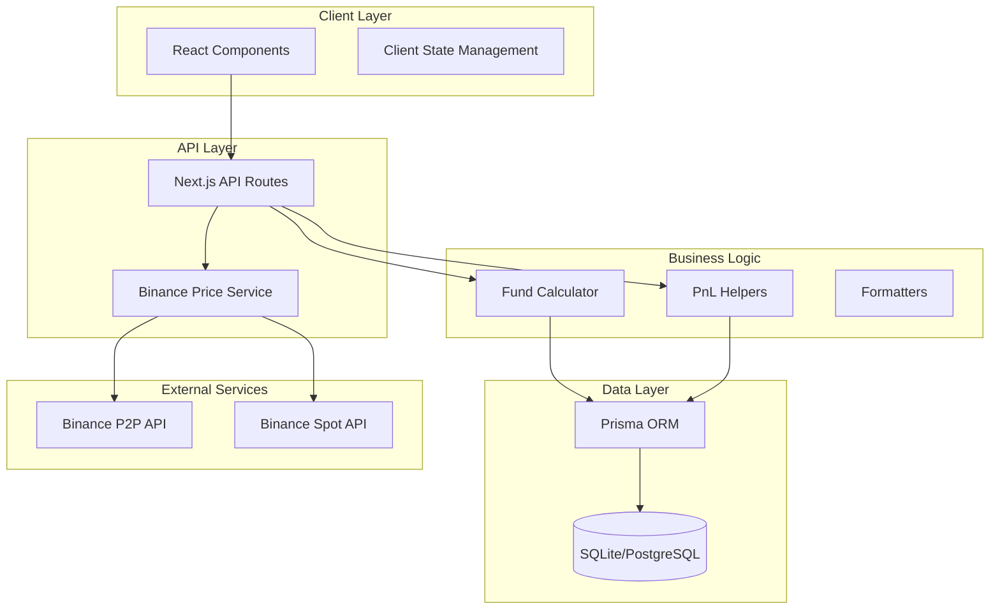
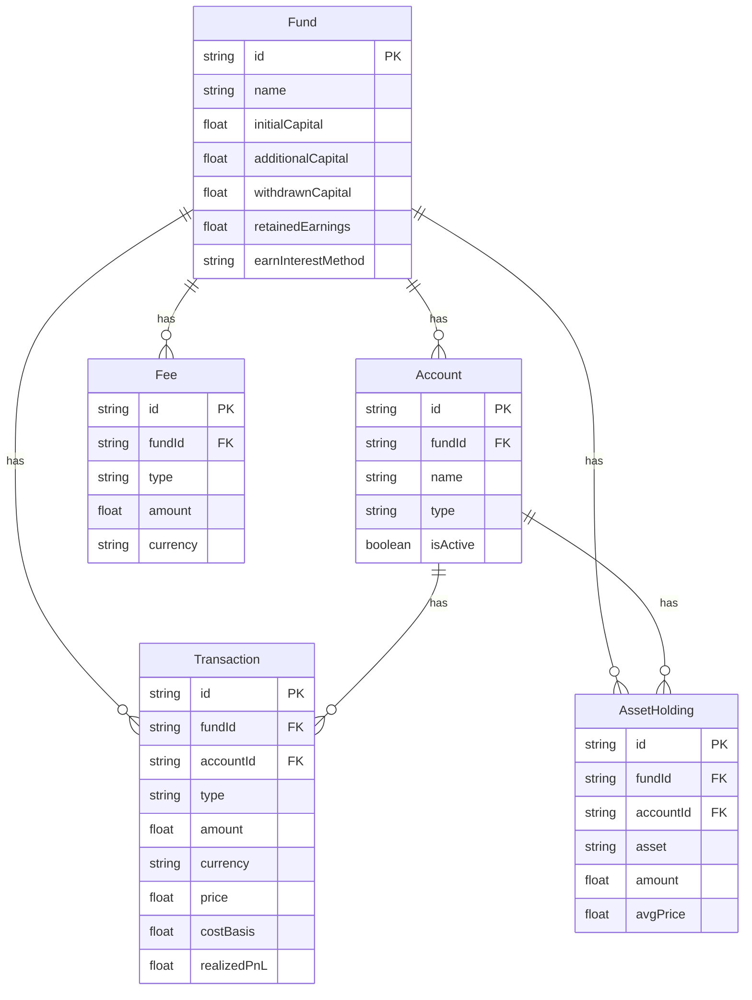
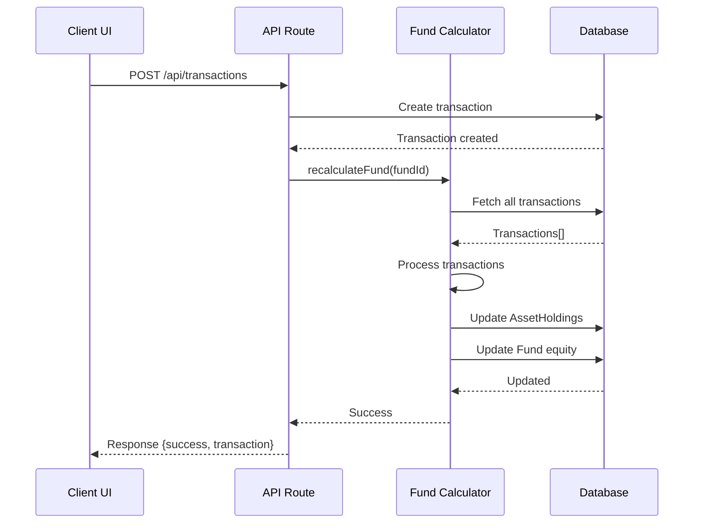
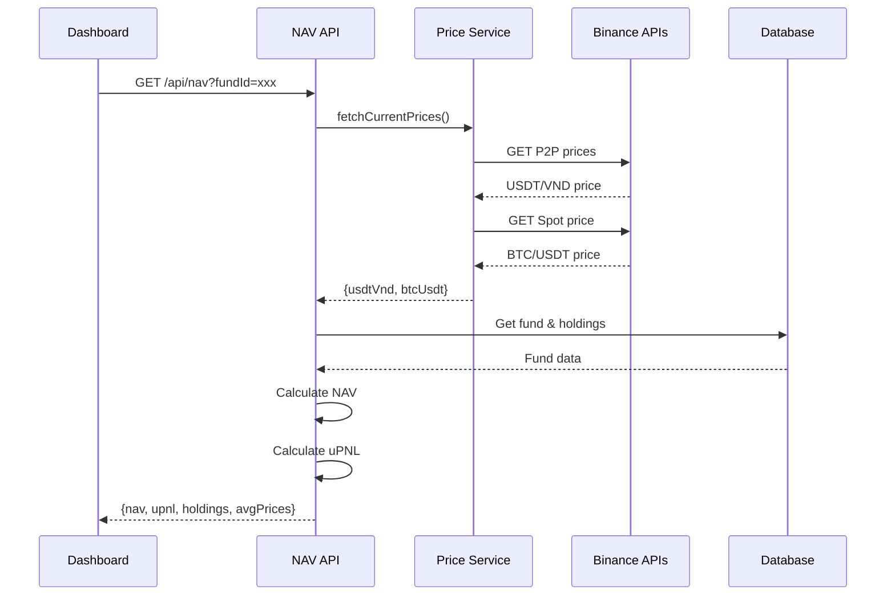

# Architecture Documentation - Fund Management System

## 📋 Tổng Quan

Hệ thống quản lý quỹ đầu tư cá nhân được xây dựng theo kiến trúc **Full-stack Web Application** với Next.js 15, sử dụng **App Router**, **Server Components**, và **API Routes** để tạo thành một ứng dụng monolithic hiện đại.

---

## 🏗️ Kiến Trúc Tổng Quan



---

## 🎯 Các Lớp Chính (Layers)

### 1. **Presentation Layer** (UI/UX)
**Vị trí**: `src/app/page.tsx`, `src/components/`

**Trách nhiệm**:
- Hiển thị giao diện người dùng
- Xử lý user interactions
- Client-side state management
- Real-time data rendering

**Công nghệ**:
- React 19 với Server Components
- shadcn/ui components
- Tailwind CSS 4
- Lucide React icons

**Main Components**:
- `page.tsx` - Dashboard chính
- `TransactionForm.tsx` - Form thêm/sửa giao dịch
- `TransactionHistory.tsx` - Lịch sử giao dịch
- `PnLAnalysis.tsx` - Phân tích lãi/lỗ
- `FundSettings.tsx` - Cài đặt quỹ
- `SiteHeader.tsx` - Header với live prices

### 2. **API Layer** (Backend Routes)
**Vị trí**: `src/app/api/`

**Trách nhiệm**:
- Xử lý HTTP requests
- Validate input data
- Gọi business logic
- Trả về JSON responses

**API Endpoints**:

```typescript
// Fund Management
GET/POST  /api/funds              -- Quản lý quỹ
PUT       /api/funds/settings     -- Cài đặt quỹ

// Transactions
GET/POST/PUT/DELETE  /api/transactions  -- CRUD giao dịch

// Calculations
POST  /api/nav                    -- Tính NAV & PnL
POST  /api/avg-price              -- Giá mua trung bình

// Analysis
GET   /api/analysis/btc-pnl       -- PnL từ BTC trading
GET   /api/analysis/usdt-pnl      -- PnL từ USDT P2P

// External Data
GET   /api/prices/current         -- Lấy giá live từ Binance

// Reports
GET   /api/reports/accounting     -- Báo cáo kế toán

// Initialization
POST  /api/init                   -- Khởi tạo quỹ mới
```

### 3. **Business Logic Layer**
**Vị trí**: `src/lib/`

**Modules**:

#### `fund-calculator.ts`
**Chức năng**: Core calculation engine
- Tính toán lại toàn bộ quỹ từ transactions
- Cập nhật asset holdings
- Tính giá mua trung bình (FIFO/Weighted Average)
- Xử lý earn interest methods
- Tính realized PnL cho mỗi giao dịch

**Key Function**:
```typescript
async function recalculateFund(fundId: string)
```

**Logic Flow**:
1. Fetch tất cả transactions theo thời gian
2. Initialize state (VND, USDT, BTC holdings)
3. Process từng transaction (switch-case theo type)
4. Tính toán giá TB, cost basis, realized PnL
5. Update database với AssetHolding mới

#### `pnl-helpers.ts`
**Chức năng**: PnL analysis utilities
- `calculateBtcRealizedPnL()` - Tính realized PnL từ BTC trading
- `calculateUsdtRealizedPnL()` - Tính realized PnL từ USDT P2P
- `countP2PTrades()` - Đếm số lượng P2P trades

#### `binance-price-service.ts`
**Chức năng**: Fetch live prices từ Binance
- `fetchBinanceP2PPrice()` - Giá USDT/VND từ P2P
  - Lấy top 12 ads
  - Loại bỏ 2 ads đầu (outliers)
  - Average 10 ads còn lại
- `fetchBinanceSpotPrice()` - Giá BTC/USDT từ Spot
  - Ticker API cho BTCUSDT pair

#### `format.ts`
**Chức năng**: Number formatting utilities
- `formatCurrency()` - Format tiền tệ (VND, USDT, BTC)
- `formatNumber()` - Format số với decimal places
- `formatPercentage()` - Format phần trăm

#### `db.ts`
**Chức năng**: Database client singleton
- Khởi tạo Prisma Client
- Optimizations cho SQLite vs PostgreSQL
- Global instance cho hot-reload

### 4. **Data Access Layer**
**Vị trí**: `prisma/`

**ORM**: Prisma 6.11.1

**Schema**: 5 models chính



**Database Support**:
- **SQLite** (Development) - File-based, fast, simple
- **PostgreSQL/Supabase** (Production) - Cloud-based, scalable

---

## 🔄 Data Flow Patterns

### Pattern 1: Transaction Creation Flow



**Bước chi tiết**:
1. User submit transaction form
2. Client gọi POST `/api/transactions`
3. API validate data và create transaction record
4. API trigger `recalculateFund(fundId)`
5. Calculator fetch tất cả transactions theo thứ tự
6. Process từng transaction để tính holdings & equity
7. Update database với state mới
8. Return success response

### Pattern 2: NAV Calculation Flow



**NAV Calculation Formula**:
```typescript
NAV_VND = holdings.vnd 
        + (holdings.usdt * currentPrice.usdtVnd)
        + (holdings.btc * currentPrice.btcUsdt * currentPrice.usdtVnd)

uPNL = NAV - totalCapital
ROI = (retainedEarnings / totalCapital) * 100
```

### Pattern 3: Average Price Calculation

**USDT Average Price** (với Earn Interest Method):

```typescript
// Method 1: reduce_avg_price (default)
totalAmount = totalBought + totalEarn
totalCost = totalSpent
avgPrice = totalCost / totalAmount

// Method 2: keep_avg_price
totalAmount = totalBought + totalEarn
totalCost = totalSpent
avgPrice = totalSpent / totalBought  // Earn không ảnh hưởng
```

**BTC Average Price** (Weighted Average):
```typescript
avgPrice = totalSpent / totalBought
```

---

## 📁 File Structure

```
fund-management/
├── prisma/
│   ├── schema.prisma           # Database schema
│   ├── migrations/             # Migration history
│   └── dev.db                  # SQLite database file
│
├── src/
│   ├── app/
│   │   ├── api/                # API Routes
│   │   │   ├── funds/
│   │   │   │   ├── route.ts    # Fund CRUD
│   │   │   │   └── settings/route.ts
│   │   │   ├── transactions/route.ts
│   │   │   ├── nav/route.ts
│   │   │   ├── avg-price/route.ts
│   │   │   ├── analysis/
│   │   │   │   ├── btc-pnl/route.ts
│   │   │   │   └── usdt-pnl/route.ts
│   │   │   ├── prices/current/route.ts
│   │   │   ├── reports/accounting/route.ts
│   │   │   └── init/route.ts
│   │   │
│   │   ├── page.tsx            # Main dashboard
│   │   └── layout.tsx          # Root layout
│   │
│   ├── components/
│   │   ├── TransactionForm.tsx
│   │   ├── TransactionHistory.tsx
│   │   ├── PnLAnalysis.tsx
│   │   ├── FundSettings.tsx
│   │   ├── site-header.tsx
│   │   ├── mode-toggle.tsx     # Dark mode toggle
│   │   └── ui/                 # shadcn/ui components
│   │
│   ├── lib/
│   │   ├── db.ts               # Prisma client
│   │   ├── fund-calculator.ts  # Core calculation engine
│   │   ├── pnl-helpers.ts      # PnL utilities
│   │   ├── binance-price-service.ts
│   │   ├── format.ts           # Formatters
│   │   └── utils.ts            # Utilities
│   │
│   └── hooks/
│       └── use-mobile.tsx
│
├── scripts/
│   ├── migrate-to-supabase.ts  # SQLite → Supabase migration
│   └── verify-db-connection.ts # Database verification
│
├── docs/
│   ├── SUPABASE_SETUP.md
│   ├── SUPABASE_QUICKREF.md
│   └── ARCHITECTURE.md         # This file
│
├── .env                        # Environment variables
├── .env.example                # Environment template
├── package.json
├── tsconfig.json
└── next.config.ts
```

---

## 🔑 Key Design Decisions

### 1. **Monolithic Architecture**
**Quyết định**: Xây dựng ứng dụng monolithic với Next.js thay vì microservices

**Lý do**:
- Đơn giản hơn cho MVP và small-scale application
- Dễ deployment (single deploy target)
- Ít overhead về infrastructure
- Phù hợp với use case personal fund management

**Trade-offs**:
- Khó scale horizontally
- Tất cả logic trong một codebase
- Nhưng: Dễ maintain và develop cho small team

### 2. **Event-Sourcing Style với Recalculation**
**Quyết định**: Mỗi khi có transaction mới, recalculate toàn bộ quỹ từ đầu

**Lý do**:
- **Data integrity**: Đảm bảo state luôn đúng
- **Flexibility**: Dễ thay đổi logic tính toán
- **Auditability**: Transactions là source of truth
- **Bug recovery**: Có thể replay transactions để fix bugs

**Implementation**:
```typescript
// Mỗi khi transaction thay đổi
await db.transaction.create(...)
await recalculateFund(fundId)  // Replay all transactions
```

**Trade-offs**:
- Performance: O(n) complexity cho mỗi transaction
- Nhưng: Acceptable cho personal use (<10k transactions)

### 3. **Database Abstraction với Prisma**
**Quyết định**: Sử dụng Prisma ORM thay vì raw SQL

**Lý do**:
- Type-safe queries
- Auto-completion
- Migration management
- Multi-database support (SQLite ↔ PostgreSQL)

**Trade-offs**:
- Thêm abstraction layer
- Một số queries phức tạp khó express
- Nhưng: Worth it cho type safety và DX

### 4. **Client-Side Price Fetching**
**Quyết định**: Fetch live prices từ client, không cache server-side

**Lý do**:
- Real-time data cho user
- Tránh stale cache issues
- User control (manual refresh button)

**Implementation**:
```typescript
// Client component
const fetchCurrentPrices = async () => {
  const response = await fetch('/api/prices/current')
  // API route fetch từ Binance real-time
}
```

### 5. **Multi-Database Support**
**Quyết định**: Hỗ trợ cả SQLite và PostgreSQL

**Lý do**:
- SQLite: Perfect cho development (zero setup)
- PostgreSQL/Supabase: Production-ready (backups, scalability)
- Users có thể choose based on needs

**Implementation Strategy**:
- Schema compatible với cả hai
- Environment variable driven (`DATABASE_URL`)
- Migration scripts cho data transfer

---

## 🎨 UI/UX Architecture

### Component Hierarchy

```
App
└── SiteHeader (fund name, live prices, dark mode)
    └── Dashboard (page.tsx)
        ├── Summary Cards (NAV, Equity, Profit, ROI)
        └── Tabs
            ├── Holdings Tab
            │   └── Asset Cards (VND, USDT, BTC)
            ├── NAV Analysis Tab
            │   └── PnLAnalysis Component
            ├── Average Price Tab
            │   └── Price Cards (USDT, BTC)
            ├── History Tab
            │   └── TransactionHistory Component
            │       └── TransactionModal (add/edit)
            └── Settings Tab
                └── FundSettings Component
```

### State Management Strategy

**Client State** (useState):
- UI state (loading, modals, tabs)
- Form data
- Current prices (real-time)

**Server State** (Fetch on demand):
- Fund data
- Transactions
- Holdings
- Calculations

**No Global State Library** (Redux/Zustand):
- Props drilling acceptable cho small app
- Component co-location preferred
- Fetch từ API khi cần

### Styling Architecture

**Approach**: Utility-first với Tailwind CSS

**Theme System**:
- CSS variables cho colors (`hsl()` format)
- Dark mode với `next-themes`
- shadcn/ui component variants

**Responsive Strategy**:
```tsx
<div className="grid grid-cols-1 md:grid-cols-2 lg:grid-cols-4">
  // Mobile: 1 column
  // Tablet: 2 columns
  // Desktop: 4 columns
</div>
```

---

## 🔒 Security Considerations

### 1. **Input Validation**
- Validate all transaction data trước khi save
- Check required fields, number ranges
- Sanitize user inputs

### 2. **Database Security**
- Prisma prevents SQL injection
- Connection string trong `.env` (not committed)
- `.gitignore` covers sensitive files

### 3. **API Security**
**Current**: No authentication (personal use)

**Future** (Multi-user):
- NextAuth.js integration
- JWT tokens
- Row-level security (Supabase)

### 4. **External API Calls**
- Binance APIs: Public endpoints (no auth needed)
- Rate limiting handled by Binance
- Fallback to default prices if API fails

---

## 📊 Performance Considerations

### 1. **Server Components**
- Dashboard uses React Server Components
- Pre-render on server when possible
- Reduce client-side JavaScript

### 2. **Database Queries**
- Indexed fields: `id`, `fundId`, `createdAt`
- Limit queries với pagination
- `include` relations selectively

### 3. **Price Fetching**
**Current**: On-demand fetch

**Future Optimizations**:
- Cache prices server-side (5 min TTL)
- Background job để update cache
- WebSocket cho real-time updates

### 4. **Calculation Performance**
- Recalculation: O(n) với n = số transactions
- Acceptable cho <10k transactions
- Nếu scale: Consider event snapshots

---

## 🧪 Testing Strategy

### Current State
- Manual testing qua UI
- Test scripts trong `test-*.sh`

### Recommended Additions

**Unit Tests**:
```typescript
// fund-calculator.test.ts
describe('recalculateFund', () => {
  it('should calculate average price correctly', ...)
  it('should handle earn interest methods', ...)
})
```

**Integration Tests**:
```typescript
// api/transactions.test.ts
describe('POST /api/transactions', () => {
  it('should create transaction and recalculate', ...)
})
```

**E2E Tests**:
- Playwright cho user flows
- Test: Create transaction → Verify NAV updates

---

## 🚀 Deployment Architecture

### Development
```bash
npm run dev  # Next.js dev server port 3000
DATABASE_URL="file:./dev.db"  # SQLite
```

### Production Options

**Option 1: Vercel (Recommended)**
```bash
# Build
npm run build

# Deploy
vercel deploy

# Environment
DATABASE_URL="postgresql://..." # Supabase
```

**Option 2: Self-hosted**
```bash
# Build standalone
npm run build

# Run
npm start

# Use Caddy for reverse proxy + SSL
```

**Docker** (Future):
```dockerfile
FROM node:20-alpine
WORKDIR /app
COPY . .
RUN npm install && npm run build
CMD ["npm", "start"]
```

---

## 🔮 Future Architecture Enhancements

### 1. **Multi-User Support**
```
Current: Single fund
Future:  User → Funds[] → Transactions[]
```

**Changes needed**:
- Add User model
- Authentication (NextAuth.js)
- Authorization (fund ownership)
- Row-level security

### 2. **Real-time Updates**
**Technology**: Supabase Realtime

```typescript
supabase
  .channel('transactions')
  .on('INSERT', ...)
  .subscribe()
```

### 3. **Background Jobs**
**Use case**: Auto-fetch prices, reports

**Technology**: Vercel Cron Jobs or BullMQ

```typescript
// api/cron/update-prices/route.ts
export async function GET() {
  await updatePricesCache()
}
```

### 4. **Analytics & Charts**
**Library**: Recharts (already installed)

**Features**:
- NAV over time
- Portfolio allocation pie chart
- P&L timeline

### 5. **Caching Layer**
**Technology**: Redis (Upstash)

```typescript
// Cache NAV calculations
const cachedNav = await redis.get(`nav:${fundId}`)
if (cachedNav) return cachedNav
```

### 6. **Audit Logs**
**Model**: `AuditLog`

```prisma
model AuditLog {
  id        String   @id
  userId    String
  action    String
  resource  String
  timestamp DateTime
}
```

---

## 📚 Technology Stack Summary

| Layer | Technology | Version | Purpose |
|-------|-----------|---------|---------|
| **Framework** | Next.js | 15.3.5 | Full-stack React framework |
| **Language** | TypeScript | 5.x | Type-safe development |
| **UI Library** | React | 19.0 | Component-based UI |
| **Styling** | Tailwind CSS | 4.x | Utility-first CSS |
| **Components** | shadcn/ui | Latest | Pre-built component library |
| **ORM** | Prisma | 6.11.1 | Type-safe database access |
| **Database (Dev)** | SQLite | Latest | File-based SQL database |
| **Database (Prod)** | PostgreSQL/Supabase | Latest | Cloud PostgreSQL |
| **Icons** | Lucide React | 0.525 | Icon library |
| **Themes** | next-themes | 0.4.6 | Dark mode support |
| **Forms** | React Hook Form | 7.60 | Form management |

**Total Dependencies**: ~85 packages

---

## 🎓 Learning Resources

Để hiểu sâu hơn về architecture:

1. **Next.js App Router**: https://nextjs.org/docs/app
2. **Prisma ORM**: https://www.prisma.io/docs
3. **Supabase**: https://supabase.com/docs
4. **shadcn/ui**: https://ui.shadcn.com
5. **Fund Accounting Basics**: [HowItWork.md](../HowItWork.md)

---

## 📝 Conclusion

Architecture này được thiết kế cho:
- ✅ **Simplicity**: Dễ hiểu và maintain
- ✅ **Type Safety**: TypeScript + Prisma
- ✅ **Flexibility**: Easy to change database/logic
- ✅ **Scalability**: Can grow from personal to multi-user
- ✅ **DX**: Great developer experience

Monolithic → Có thể refactor sang microservices sau nếu cần
Event-sourcing-style → Data integrity đảm bảo
Prisma → Multi-database support

**Architecture phù hợp cho MVP và scale up to ~1000 users.**
